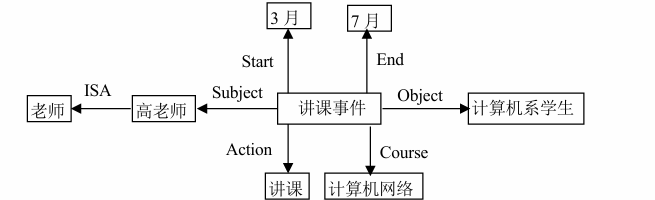
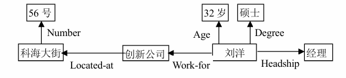
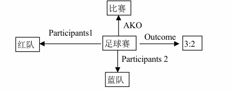

1
谓词定义：
- On(x, y)  表示积木x直接放置在y上，x为积木，y为积木或桌子（Table）
- Clear(x)  表示积木x顶部没有其他积木（可操作状态），参数范围：x为积木
- Holding(x) 表示机器人手中持有积木x
- HandEmpty 表示机器人手为空

动作的谓词表示
- 从桌上拣起积木（PickUpFromTable(x)）
    前提 \( \text{On}(x, \text{Table}) \land \text{Clear}(x) \land \text{HandEmpty} \)
    效果 \( \neg \text{On}(x, \text{Table}) \land \neg \text{Clear}(x) \land \text{Holding}(x) \land \neg \text{HandEmpty} \)
- 将积木放到桌上（PutOnTable(x)）
  前提 \( \text{Holding}(x) \)
  效果 \( \text{On}(x, \text{Table}) \land \text{Clear}(x) \land \text{HandEmpty} \land \neg \text{Holding}(x) \)
- 将积木摞到另一积木上（Stack(x, y)）
  前提 \( \text{Holding}(x) \land \text{Clear}(y) \)（y为积木）
  效果 \( \text{On}(x, y) \land \text{Clear}(x) \land \text{HandEmpty} \land \neg \text{Holding}(x) \land \neg \text{Clear}(y) \)
- 从积木上拣起积木（Unstack(x, y)）
  前提 \( \text{On}(x, y) \land \text{Clear}(x) \land \text{HandEmpty} \)（y为积木）
  效果 \( \text{Holding}(x) \land \neg \text{On}(x, y) \land \text{Clear}(y) \land \neg \text{HandEmpty} \)

2
（1）

（2）

（3）

3 
Frame<天气预报> 
    地域：北京 
    时段：今天白天 
    天气：晴 
    风向：偏北 
    风力：3级 
    气温：最高：12度 
          最低：-2度 
    降水概率：15% 