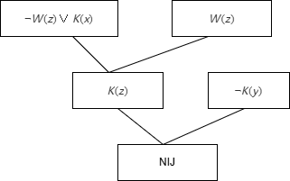

220110515 金正达

2.9 
(1)
谓词：$\text{LIKE}(x, y): x \text{喜欢} y$
个体：$x: \text{人}, y: m(\text{梅花}), j(\text{菊花})$
谓词公式：$\exists x(\text{LIKE}(x, m) \vee \text{LIKE}(x, j) \wedge \text{LIKE}(x, m),\wedge \text{LIKE}(x, j))$
(2)
谓词：$B(x): x \text{打篮球}, A(y): y \text{是下午}$
个体：$x$ 为人， $y$ 为时间
谓词公式：$\exists x(\forall y(A(y) \to B(x)))$
(3)
谓词：$C(x) x\text{为新型计算机}, F(x): x\text{速度快}, B(x): x\text{的存储容量}$
个体：$x$ 为计算机
谓词公式：$\forall x (C(x) \to F(x) \wedge B(x))$
(4)
谓词：$S(x): x\text{是计算机系学生}, L(x, y): x\text{喜欢}y$
个体：$x$ 为学生，$p$ 为在计算机上编程
谓词公式：$\neg(\forall x)(S(x) \to L(x, c)) $
(5)
谓词：$L(x, y): x\text{喜欢}y$
个体：$x$ 为人，$p$ 为编程，$c$为计算机
谓词公式：$\forall x(L(x, p) \to L(x, c))$

2.32
(1)可合一，置换：$\lambda = {a / x, b / y}$
(2)可合一，置换：$\lambda = {y / f(x), b / z}$
(3)可合一，置换：$\lambda = {f(b) / y, b / x}$
(4)不可合一
(5)可合一，置换：$\lambda = {y / x}$

2.37
(1) $S = {P(x, y), Q(a, b)}$
(2) $S = {\neg P(x, y) \vee Q(x, y)}$
(3) $S = {P(x, f(x)) \vee \neg Q(x, f(x)) \vee R(x, f(x))}$
(4) $S = {\neg P(x, y) \vee Q(x, y) \vee R(x, f(x, y))}$

2.42
谓词：$R(x): x\text{能阅读}, K(y): y\text{识字}, W(z): z\text{很聪明}$
谓词公式：
$$
\begin{cases}
    \forall x (R(x) \to K(x)) \\
    \forall y \neg K(y) \\
    \exists z W(z)
\end{cases}
\to
\exists x (W(z) \wedge \neg K(x))
$$
子句集：
$$
\neg R(x) \vee K(x), \neg K(y), W(z), \neg W(z) \vee K(x)
$$
归结演绎推理：
